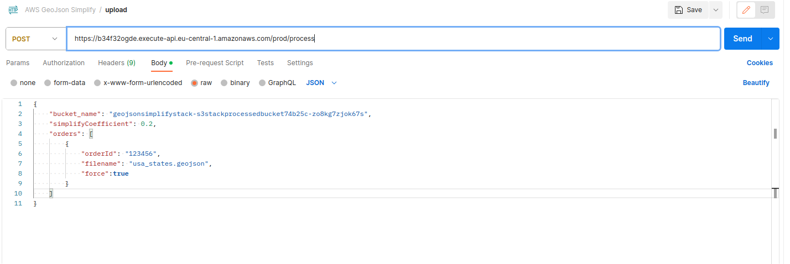

# AWS-CDK for GeoJSON Simplify Service
## Disclaimer
This project was created for educational purposes, but if you want to use any ideas
in your own work, you are more than welcome.

## Overview
This project includes AWS CDK definitions for the GeoJSON simplify service.
The service has one endpoint that is used to submit a simplify job for the GeoJSON files that are
stored in S3. GeoJSON is a very popular format for drawing geographical borders on the web; however,
often the files are too large for Web Applications (larger than 50MB). To solve this issue,
we can decrease the size of the files by simplifying the border polygons using the
[mapshaper library](https://github.com/mbloch/mapshaper/blob/master/REFERENCE.md).

When you deploy the infrastructure via 'cdk deploy', it will create
two S3 buckets for original and processed images, a REST API endpoint to submit the request,
a DynamoDB table to keep track of submitted orders, an SQS, and two Lambdas: one for enqueuing the task and the second one
to process the task.

## Prerequisites
1. **AWS Account**: [Sign up for a free tier account](https://aws.amazon.com/free/).
2. **AWS CLI**: [Install and configure](https://docs.aws.amazon.com/cli/latest/userguide/install-cliv2.html).
3. **Node.js**: AWS CDK requires Node.js (LTS version recommended). [Download](https://nodejs.org/).
4. **AWS CDK**: [Installation guide](https://docs.aws.amazon.com/cdk/v2/guide/getting_started.html).

## How to use the service
After you call `cdk deploy`, AWS CDK will create an AWS stack for the project on your AWS account. It will show a "Deployment is
successful" message along with the RestAPI endpoint, in a format like this:
```bash
"✨  Deployment time: 27.32s

Outputs:
GeoJsonSimplifyStack.GeoJsonApiEndpointF10593D3 = https://b34f32ogde.execute-api.eu-central-1.amazonaws.com/prod/
" 
```
This is your endpoint, which has only one resource, `/process`. Before starting the simplification process for your GeoJSONs,
you need to save them in the original_bucket on your S3 that was just created. The S3 bucket names must be unique globally, so the name is auto-generated and will look something like this:
```bash
geojsonsimplifystack-s3stackprocessedbucket74b25c-zo8kg7zjok67s
```
GeoJSONs for all the countries can be downloaded from [GADM website](https://gadm.org/download_country.html),
usually these GEOJSONs are ~60-70 MB, and after simplification with a default coefficient of 0.2, they will be reduced to around 3-4 MB.


After you uploaded required GEOJSON to s3, call the REST API enpoint resource /process with the similar POST body:

### Test POST Body
```json
{
    "bucket_name": "geojsonsimplifystack-s3stackprocessedbucket74b25c-zo8kg7zjok67s",
    "simplifyCoefficient": 0.2,
    "orders": [
        {
            "orderId": "123456",
            "filename": "usa_states.geojson",
            "force":true
        }
    ]
}
```
### Explanation of the fields in the Body:
- 'bucket_name' - backet name that was created on you AWS account where not simplified files are stored.
- 'simplifyCoefficient': a value between 0 and 1, that corresponds to the level of simplification. The default value is 0.2.
This repository is using [mapshapper library](https://github.com/mbloch/mapshaper/blob/master/REFERENCE.md) where you can learn more about this parameter.
- 'orders': - array of orders, every order contains:
    - 'orderId' - supportive information can be any unique string.
    - 'filename' - the file stored in S3 that you want to simplify.
    - 'force' - a  parameter specifying if you want to rewrite already existing files.


After you submit the post request, 'enqueue' lambda will put these items into SQS and they will be processed one by one, after few minutes you should see you simplified geojsons in the "processed" S3 bucket (it will also have auto generated name).



## Useful commands

- `npm run build` compile typescript to js
- `npm run watch` watch for changes and compile
- `npm run test` perform the jest unit tests
- `cdk diff` compare deployed stack with current state
- `cdk synth` emits the synthesized CloudFormation template
